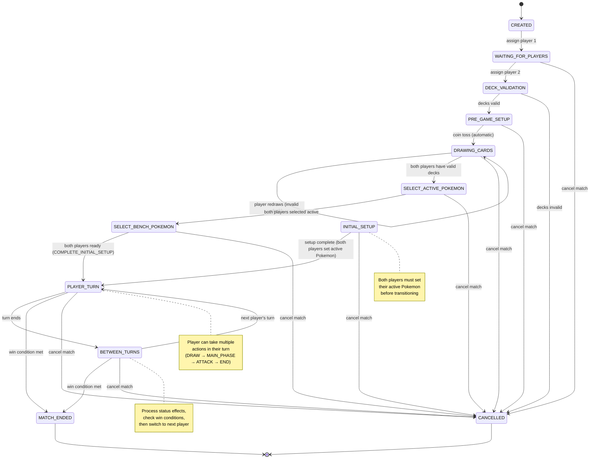

# Match State Machine Diagram

Complete visual representation of the match state machine and all valid state transitions.

## State Machine Diagram



## State Descriptions

### Terminal States

- **MATCH_ENDED**: Match completed with a winner
  - Cannot transition to any other state
  - Final state when a win condition is met

- **CANCELLED**: Match cancelled (cannot resume)
  - Cannot transition to any other state
  - Can be reached from any non-terminal state

### Initial States

- **CREATED**: Match created, no players assigned
  - Initial state when match is first created
  - Transitions to `WAITING_FOR_PLAYERS` when first player is assigned

### Pre-Game States

- **WAITING_FOR_PLAYERS**: Waiting for players to join
  - One player has joined, waiting for second player
  - Transitions to `DECK_VALIDATION` when both players join

- **DECK_VALIDATION**: Validating both player decks
  - Both players have joined with decks
  - Validates decks against tournament rules
  - Transitions to `PRE_GAME_SETUP` if valid, `CANCELLED` if invalid

- **PRE_GAME_SETUP**: Coin flip, determine first player
  - Decks are validated
  - Automatically performs coin toss to determine first player
  - Transitions to `DRAWING_CARDS` after coin toss

- **DRAWING_CARDS**: Players draw initial 7 cards
  - Each player independently draws 7 cards by clicking "Draw Cards"
  - Hands are validated against start game rules
  - If invalid, player must redraw (opponent can see drawn cards)
  - If valid, player's deck is marked as valid
  - Transitions to `SELECT_ACTIVE_POKEMON` when both players have valid decks

- **SELECT_ACTIVE_POKEMON**: Players select active Pokemon
  - Both players select their active Pokemon
  - Players can only see opponent's active Pokemon after selecting their own
  - Transitions to `SELECT_BENCH_POKEMON` when both players selected

- **SELECT_BENCH_POKEMON**: Players optionally select bench Pokemon
  - Both players can optionally play Pokemon to bench (max 5)
  - Players can skip this step
  - Prize cards are set up (6 for each player)
  - Transitions to `PLAYER_TURN` when both players are ready

- **INITIAL_SETUP**: Initial game setup (legacy state)
  - Both players shuffle decks
  - Both players draw 7 cards
  - Both players set active Pokemon
  - Both players draw 6 prize cards
  - First player draws 1 card (if going first)
  - Transitions to `PLAYER_TURN` when setup is complete

### Gameplay States

- **PLAYER_TURN**: Active player's turn
  - Current player can take actions
  - Progresses through phases: DRAW → MAIN_PHASE → ATTACK → END
  - Transitions to `BETWEEN_TURNS` when turn ends
  - Can transition to `MATCH_ENDED` if win condition is met

- **BETWEEN_TURNS**: Processing between-turn effects
  - Process status effects (poison, burn)
  - Check win conditions
  - Switch to next player
  - Transitions to `PLAYER_TURN` for next player
  - Can transition to `MATCH_ENDED` if win condition is met

## State Transition Table

| From State | To State | Trigger | Notes |
|------------|----------|---------|-------|
| CREATED | WAITING_FOR_PLAYERS | Assign player 1 | First player joins |
| WAITING_FOR_PLAYERS | DECK_VALIDATION | Assign player 2 | Second player joins |
| WAITING_FOR_PLAYERS | CANCELLED | Cancel match | Match cancelled |
| DECK_VALIDATION | PRE_GAME_SETUP | Decks valid | Both decks pass validation |
| DECK_VALIDATION | CANCELLED | Decks invalid | One or both decks fail validation |
| PRE_GAME_SETUP | DRAWING_CARDS | Coin toss (automatic) | First player determined |
| PRE_GAME_SETUP | CANCELLED | Cancel match | Match cancelled |
| DRAWING_CARDS | DRAWING_CARDS | Player redraws | Invalid deck, must redraw |
| DRAWING_CARDS | SELECT_ACTIVE_POKEMON | Both valid decks | Both players have valid decks |
| DRAWING_CARDS | CANCELLED | Cancel match | Match cancelled |
| SELECT_ACTIVE_POKEMON | SELECT_BENCH_POKEMON | Both selected active | Both players selected active Pokemon |
| SELECT_ACTIVE_POKEMON | CANCELLED | Cancel match | Match cancelled |
| SELECT_BENCH_POKEMON | PLAYER_TURN | Both ready | Both players clicked COMPLETE_INITIAL_SETUP |
| SELECT_BENCH_POKEMON | CANCELLED | Cancel match | Match cancelled |
| INITIAL_SETUP | PLAYER_TURN | Setup complete | Both players set active Pokemon (legacy) |
| INITIAL_SETUP | CANCELLED | Cancel match | Match cancelled |
| PLAYER_TURN | BETWEEN_TURNS | Turn ends | Player ends their turn |
| PLAYER_TURN | MATCH_ENDED | Win condition met | Prize cards, no Pokemon, or deck out |
| PLAYER_TURN | CANCELLED | Cancel match | Match cancelled |
| BETWEEN_TURNS | PLAYER_TURN | Next turn | Switch to next player |
| BETWEEN_TURNS | MATCH_ENDED | Win condition met | Prize cards, no Pokemon, or deck out |
| BETWEEN_TURNS | CANCELLED | Cancel match | Match cancelled |

## Turn Phases (within PLAYER_TURN state)

During `PLAYER_TURN`, the game progresses through phases:

```
DRAW → MAIN_PHASE → ATTACK → END
```

### Phase Descriptions

- **DRAW**: Draw 1 card (except first turn of first player)
  - Valid actions: `DRAW_CARD`, `END_TURN`
  - After `DRAW_CARD`: moves to `MAIN_PHASE`

- **MAIN_PHASE**: Play cards, attach energy, evolve, retreat, attack
  - Valid actions: `PLAY_POKEMON`, `ATTACH_ENERGY`, `PLAY_TRAINER`, `EVOLVE_POKEMON`, `RETREAT`, `USE_ABILITY`, `END_TURN`
  - Can perform multiple actions in this phase
  - Stays in `MAIN_PHASE` until `END_TURN` or moving to `ATTACK` phase

- **ATTACK**: Declare and execute attack
  - Valid actions: `ATTACK`, `END_TURN`
  - After `ATTACK`: moves to `END` phase

- **END**: End turn actions
  - Valid actions: `END_TURN`
  - After `END_TURN`: transitions to `BETWEEN_TURNS` state

## Win Conditions

The match can end in `MATCH_ENDED` state when any of these conditions are met:

1. **Prize Cards**: Player takes all 6 prize cards
2. **No Pokemon**: Opponent has no Pokemon in play (active + bench)
3. **Deck Out**: Opponent cannot draw a card (deck is empty)
4. **Concede**: Opponent concedes the match

## State Flow Example

### Complete Match Lifecycle

```
1. CREATED
   ↓ (player 1 joins)
2. WAITING_FOR_PLAYERS
   ↓ (player 2 joins)
3. DECK_VALIDATION
   ↓ (decks valid)
4. PRE_GAME_SETUP
   ↓ (coin toss, first player = PLAYER1, automatic)
5. DRAWING_CARDS
   ↓ (player 1 draws cards, validates)
   ↓ (player 2 draws cards, validates)
   ↓ (both players have valid decks)
6. SELECT_ACTIVE_POKEMON
   ↓ (player 1 selects active)
   ↓ (player 2 selects active)
   ↓ (both players selected)
7. SELECT_BENCH_POKEMON
   ↓ (prize cards set up)
   ↓ (player 1 ready)
   ↓ (player 2 ready)
   ↓ (both players ready)
8. PLAYER_TURN (PLAYER1, DRAW phase)
   ↓ (draw card)
   PLAYER_TURN (PLAYER1, MAIN_PHASE)
   ↓ (play cards, attach energy)
   PLAYER_TURN (PLAYER1, ATTACK phase)
   ↓ (attack)
   PLAYER_TURN (PLAYER1, END phase)
   ↓ (end turn)
9. BETWEEN_TURNS
   ↓ (process effects, switch player)
10. PLAYER_TURN (PLAYER2, DRAW phase)
   ↓ (repeat until win condition)
   ...
   ↓ (win condition met)
11. MATCH_ENDED
```

## Special Cases

### INITIAL_SETUP State

- Both players can set their active Pokemon simultaneously
- `SET_ACTIVE_POKEMON` action is valid regardless of phase
- Match transitions to `PLAYER_TURN` when both players have set their active Pokemon

### CANCELLED State

- Can be reached from any non-terminal state
- Typically triggered by:
  - Player leaving
  - System error
  - Invalid deck validation
  - Manual cancellation

### CONCEDE Action

- Available in all states (except terminal states)
- Immediately transitions to `MATCH_ENDED` with opponent as winner

## Visual State Flow (Text Diagram)

```
                    [CREATED]
                       |
                       | (assign player 1)
                       ↓
            [WAITING_FOR_PLAYERS]
                       |
                       | (assign player 2)     (cancel)
                       ↓                        ↓
            [DECK_VALIDATION] ───────────→ [CANCELLED]
                       |
                       | (decks valid)    (decks invalid)
                       ↓                        ↓
            [PRE_GAME_SETUP] ───────────→ [CANCELLED]
                       |
                       | (coin toss)      (cancel)
                       ↓                        ↓
            [DRAWING_CARDS] ─────────────→ [CANCELLED]
                       |
                       | (both valid)     (cancel)
                       ↓                        ↓
            [SELECT_ACTIVE_POKEMON] ─────→ [CANCELLED]
                       |
                       | (both selected)  (cancel)
                       ↓                        ↓
            [SELECT_BENCH_POKEMON] ───────→ [CANCELLED]
                       |
                       | (both ready)     (cancel)
                       ↓                        ↓
            [PLAYER_TURN] ───────────────→ [CANCELLED]
                       |
                       | (turn ends)  (win condition)
                       ↓              ↓
            [BETWEEN_TURNS]    [MATCH_ENDED]
                       |
                       | (next turn)  (win condition)  (cancel)
                       ↓              ↓                 ↓
            [PLAYER_TURN]    [MATCH_ENDED]      [CANCELLED]
                       |
                       └──────────────────────────────┘
                              (loop until match ends)
```

## Implementation Notes

- All state transitions are validated by `MatchStateMachineService`
- Invalid transitions throw domain exceptions
- State machine enforces business rules
- Terminal states (`MATCH_ENDED`, `CANCELLED`) cannot transition
- `CANCELLED` can be reached from any non-terminal state

---

**Related Documentation:**
- [MATCH-API.md](./MATCH-API.md) - Complete API reference
- [CLIENT-MATCH-FLOW.md](./CLIENT-MATCH-FLOW.md) - Client implementation guide
- [Match Business Rules](../src/modules/match/docs/business-rules.md) - Detailed business rules

